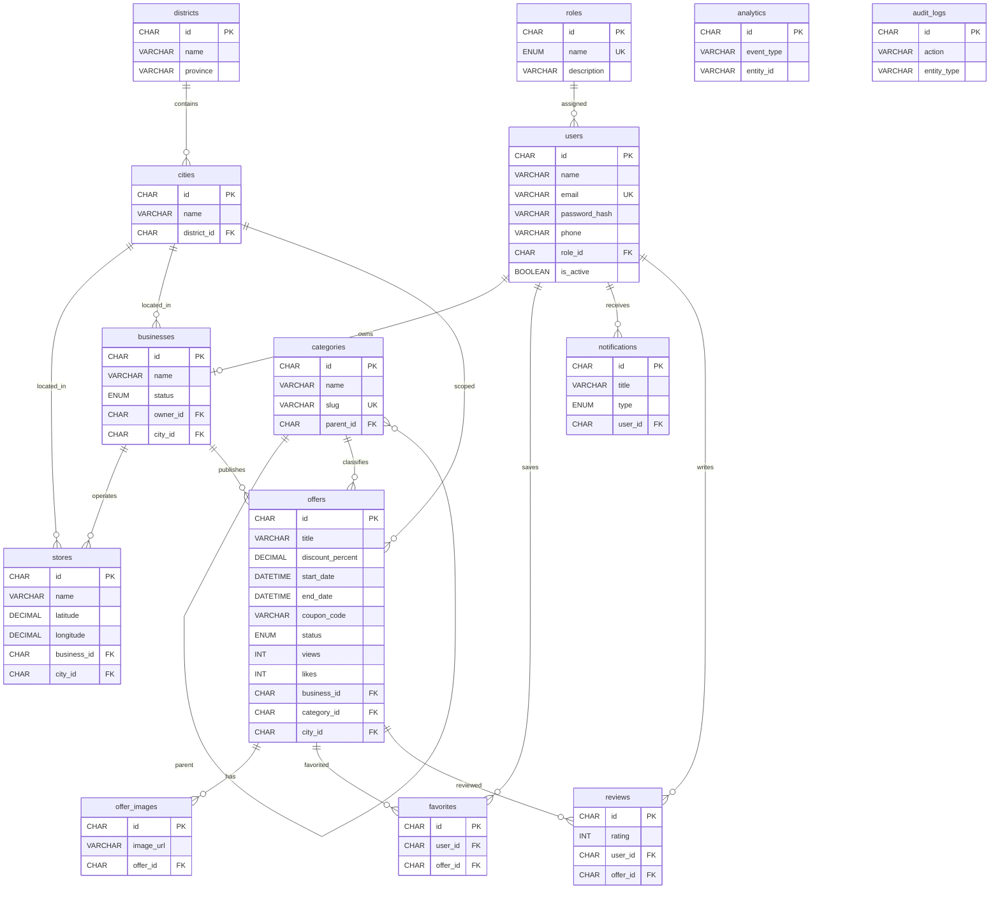

# Offer Lanka — Entity Relationship Diagram

Matches `database/schema.sql` and NestJS TypeORM entities.

## Audit columns (all main tables)

- `created_by`, `updated_by`
- `created_date`, `updated_date`
- `is_deleted` (soft delete)
